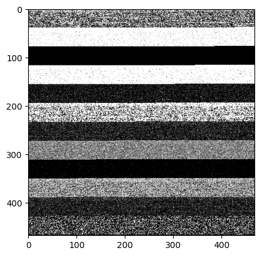

# My Kaggle code for Open Problems – Single-Cell Perturbations competition

This is my codes for the [Open Problems – Single-Cell Perturbations](https://www.kaggle.com/competitions/open-problems-single-cell-perturbations) on Kaggle.

### Highlighted Notebook

**Notebook: [opscp-m-nb019.ipynb](opscp-m-nb019.ipynb)**  
This notebook is my personal favorite. This code convert table data to image format and then use image-based models for training

### Code Snippets

#### Data Analysis and Statistics

```python
def calculate_statistic(df, group_col, cols, stat_func, stat_name):
    """
    Function to calculate statistics for given columns grouped by a specific column.
    """
    stat_df = df.groupby(group_col)[cols].apply(stat_func)
    stat_df.columns = [f'{group_col}_{stat_name}_{col}' for col in cols]
    return stat_df.reset_index().astype({group_col: str})

# Example usage for calculating various statistics for 'cell_type'
cell_type_mean = calculate_statistic(all_de_train, "cell_type", genes, lambda x: x.mean(), 'mean')
cell_type_std = calculate_statistic(all_de_train, "cell_type", genes, lambda x: x.std(), 'std')
# Additional statistics like min, max, median, skew, kurtosis, and ratio_mean_std are also calculated
```

#### Machine Learning Pipeline

```python
import math
import numpy as np
import torch
import torch.nn as nn
import torch.nn.functional as F
import torch.optim as optim
from torch.utils.data import DataLoader, TensorDataset
from torchvision import models
from sklearn.model_selection import train_test_split
from sklearn.preprocessing import StandardScaler
from sklearn.decomposition import TruncatedSVD

def convert_to_image_format(data, output_size=(224, 224)):
    """
    Function to convert data to a format suitable for image-based models.
    """
    # Code to pad and reshape data to image format
    # ...

# SVD for dimensionality reduction
n_components = 100
y_svd = TruncatedSVD(n_components=n_components, random_state=6174)
y_truncated = y_svd.fit_transform(y_train.values)

# Convert scaled data to image format and then to tensors
X_img = convert_to_image_format(X_train.values)
X_tensor = torch.tensor(X_img, dtype=torch.float32).permute(0, 3, 1, 2)
y_tensor = torch.tensor(y_truncated, dtype=torch.float32)

# Setup for KFold and training parameters
num_epochs = 50
```

#### Sample Image

